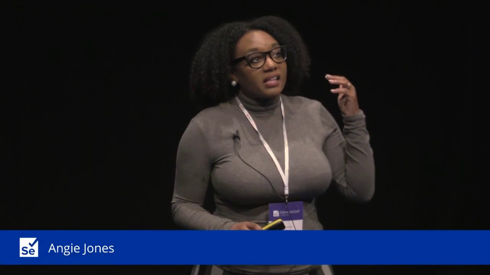

# Industry Collaboration Project

[Course Repo](https://github.com/Make-School-Courses/SPD-2.1-Industry-Collaboration-Project)

[Course Tracker](https://docs.google.com/spreadsheets/d/19eUZSsXGDw89uCwRQXI0vGzw_P0WqstopeJGF__A00A/)

[DAY 1] You have to proven that you made value before you ask for value back.

[DAY 2] Using a document is a really strong medium to get on the same page
- Super Helpful Contracting Documents
    - [PRD](https://docs.google.com/document/d/1yBeXWSXYcN7VtEzTlTCgGNmziu5SyA0uuzCjQ_5AYNE/edit#heading=h.xwa1eewr0yya)
    - [First Call Prep]()https://docs.google.com/document/d/10u8lI0VhBcj69hdTFDsZAdA_PgZ6136Bsvrnn8jwlmQ/edit

[DAY 6] TIG Contigous Integration can be helpful when working on a team so that when a development branch wants to merge into master test run automaticly before the merge 

[Day 7] Effective Badgering is to 
encourage follow-through via altrustic consideration and kindness
- [Delegation and Follow Through Presentation Slides](https://docs.google.com/presentation/d/1PuHmtxsSTUmy1tYqYqWxz5AdmbupF8v6xAsa94XYHoc/edit)

[DAY 9] Data driving our development work is safer
  - [Google Analytics](https://analytics.google.com/analytics/web/)

[DAY 10] Data Transparency: Ensure the most important data can be discovered and interpreted by everyone
- [Tableau](https://public.tableau.com/en-us/gallery/?tab=viz-of-the-day&type=viz-of-the-day)
  
[Image Source](https://www.google.com/url?sa=i&source=images&cd=&ved=2ahUKEwiEgPS8oabkAhVQrZ4KHY4EBWEQjRx6BAgBEAQ&url=%2Furl%3Fsa%3Di%26source%3Dimages%26cd%3D%26ved%3D%26url%3Dhttps%253A%252F%252Fwww.youtube.com%252Fwatch%253Fv%253DDBIIYffIfv8%26psig%3DAOvVaw1N8lGF7tJO_TuOA57axXhb%26ust%3D1567105419720638&psig=AOvVaw1N8lGF7tJO_TuOA57axXhb&ust=1567105419720638)
